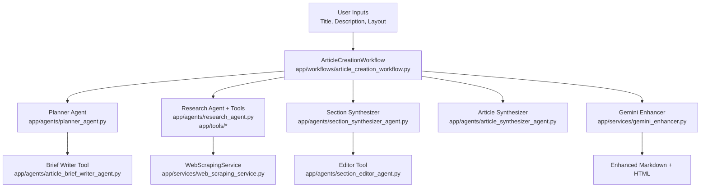

# Functional Overview

## Overview

The agentic blog writer is a Python application that automates the creation of high-quality blog articles using a multi-agent workflow. It leverages the OpenAI Agents SDK to orchestrate planning, research, web scraping, section synthesis, article composition, and optional Gemini-based enhancement. Users interact via a terminal interface, providing a topic and layout; the system then produces a complete, SEO-optimized markdown article with references, using cached results and live status updates throughout the process.

### Problem statement & scope
- **Problem**: Automate high‑quality blog article creation by orchestrating planning, web research, scraping, section synthesis, whole‑article composition, and final enhancement.
- **Scope**: Interactive terminal workflow that takes a topic and layout constraints, performs agentic research and writing with the OpenAI Agents SDK, and optionally enhances the output with Google Gemini.

### High‑level objectives and success criteria
- **Objectives**
  - Plan sections and research queries aligned to a provided layout and brief.
  - Collect and normalize external content via search and scraping.
  - Synthesize polished sections, then compose a cohesive, SEO‑optimized article.
  - Optionally enhance and fact‑check with Gemini using Google Search Grounding.
- **Success criteria**
  - Produces a complete markdown article with title, metadata, TOC, body, conclusion, references [evidence: `app/agents/article_synthesizer_agent.py:40-54`].
  - Uses provided layout and inputs without deviation when specified [evidence: `app/agents/article_synthesizer_agent.py:17-23,36-39`].
  - Enhancement returns improved markdown, persisted to cache, convertible to HTML [evidence: `app/workflows/article_creation_workflow.py:493-517,508-514`].

### Capabilities (inputs → processing → outputs)
- **Input capture**
  - Interactive prompt for title, description, article_layout, desired length [evidence: `app/workflows/article_creation_workflow.py:596-615`].
  - Workflow config object passed to agents via RunContext [evidence: `app/agents/article_synthesizer_agent.py:13-15,36-39`].
- **Planning**
  - Planner creates section plans; enforces layout; crafts research queries; self‑reviews [evidence: `app/agents/planner_agent.py:29-46`].
  - Planner invokes Brief Writer tool once to generate article brief [evidence: `app/agents/planner_agent.py:48-56` and `app/agents/article_brief_writer_agent.py:10-19`].
- **Research & scraping**
  - Research agent integrates search tools (Serper, optional DDG/Bing) [evidence: `docs/00_repo-inventory.md:116-129`, `app/tools/serper_websearch.py:17-24`, `app/tools/web_search_tool.py:11-16,37-40`, `app/tools/bing_websearch.py:11-19,34-43,58-72`].
  - WebScrapingService fetches URLs and extracts content via Crawl4AI/Firecrawl/Newspaper4k [evidence: `app/services/web_scraping_service.py:106-118,120-167`, `app/tools/scraper.py:10-14,24-33,51-57,73-91`].
- **Section synthesis**
  - Section Synthesizer turns plan + research notes into polished markdown; must call Editor tool for refinement [evidence: `app/agents/section_synthesizer_agent.py:12-25,45-51`].
  - Workflow runs section syntheses concurrently and aggregates results [evidence: `app/workflows/article_creation_workflow.py:369-387`].
- **Article synthesis**
  - Final Article Synthesizer transforms synthesized sections into complete article components and full markdown [evidence: `app/agents/article_synthesizer_agent.py:28-54,55-59`].
- **Enhancement (optional)**
  - Gemini enhancer fact‑checks with Google Search Grounding and outputs enhanced markdown [evidence: `app/services/gemini_enhancer.py:46-55,80-87,96-102`].
  - Workflow persists enhanced output and renders HTML for preview [evidence: `app/workflows/article_creation_workflow.py:508-517`].
- **Caching & display**
  - JSON cache per phase: save/load/skip when available [evidence: `app/services/workflow_data_manager.py:12-21,22-38,39-55,81-101`].
  - Live status printing and summaries [evidence: `app/services/workflow_display_manager.py:31-46,48-63,65-83,84-104,105-123,124-149` and `app/core/printer.py:8-19,26-33,38-46`].
- **Configuration**
  - `.env`‑backed config validates required keys and exposes model settings [evidence: `app/core/config.py:3-6,39-51,66-78,81-93,95-96`].

### Non‑goals
- Running a persistent API server or web UI (no FastAPI routers present) [evidence: `docs/00_repo-inventory.md:61-63`].
- Guaranteeing citation‑level provenance (references list is output‑level, not in‑text) [evidence: `app/agents/article_synthesizer_agent.py:52-53`].
- Multi‑language translation beyond preserving input language in enhancement [evidence: `app/services/gemini_enhancer.py:66-70`].

### Example end‑to‑end run (numbered)
1. User runs the workflow and inputs title, description, layout, word count [evidence: `app/workflows/article_creation_workflow.py:596-615`].
2. Planner generates section plans and article brief; validates layout [evidence: `app/agents/planner_agent.py:29-46,48-56`].
3. Research agent searches and gathers candidate URLs; scraper extracts content [evidence: `app/tools/serper_websearch.py:17-24`, `app/services/web_scraping_service.py:106-118,120-167`].
4. For each section, Section Synthesizer produces markdown, calling Editor tool, running concurrently [evidence: `app/agents/section_synthesizer_agent.py:21-25,45-51`, `app/workflows/article_creation_workflow.py:369-387`].
5. Final Article Synthesizer composes title, metadata, TOC, body, conclusion, references, and full markdown [evidence: `app/agents/article_synthesizer_agent.py:40-54`].
6. Gemini enhancer (optional) fact‑checks and enhances; HTML preview rendered; results cached [evidence: `app/workflows/article_creation_workflow.py:493-521,508-514`].

Short example: “AI in Supply Chain” → section plans → search+scrape → per‑section drafts → final article markdown → Gemini‑enhanced markdown+HTML.

### Assumptions & constraints
- Requires valid API keys for OpenAI and Gemini; validation enforced at startup [evidence: `app/core/config.py:66-78`].
- Network access for search/scraping and external APIs [evidence: `app/tools/*`, `app/services/web_scraping_service.py:106-167`].
- Terminal execution; no CLI command wrappers implemented [evidence: `docs/00_repo-inventory.md:61-62`].
- Research concurrency and retries bounded by config [evidence: `app/core/config.py:59-61`].

### Flowchart

