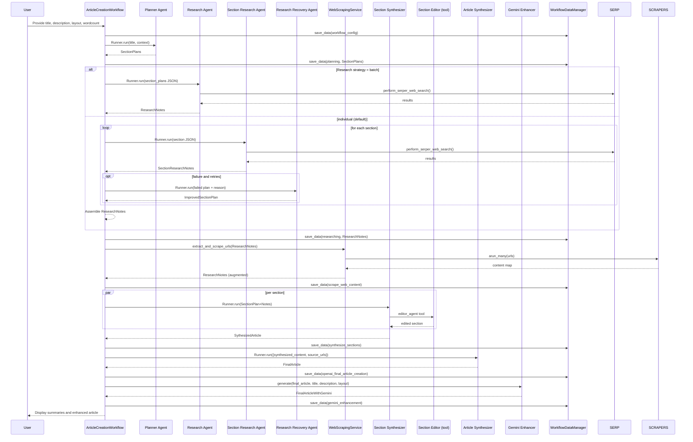

# System Architecture

## Overview

The system architecture of the agentic blog writer is designed to be modular and scalable, with a focus on flexibility and maintainability. It is built using the OpenAI Agents SDK, which provides a framework for building and running agents. The system is designed to be easy to extend and modify, with a focus on reusability and maintainability.


### Component Diagram

```mermaid
graph TB
  subgraph Orchestrator
    A["ArticleCreationWorkflow\napp/workflows/article_creation_workflow.py"]
  end

  subgraph Agents
    P["Planner Agent\napp/agents/planner_agent.py"]
    R["Research Agent\napp/agents/research_agent.py"]
    SR["Section Research Agent\napp/agents/section_research_agent.py"]
    RR["Research Recovery Agent\napp/agents/research_recovery_agent.py"]
    SS["Section Synthesizer Agent\napp/agents/section_synthesizer_agent.py"]
    SE["Section Editor Agent (tool)\napp/agents/section_editor_agent.py"]
    AS["Article Synthesizer Agent\napp/agents/article_synthesizer_agent.py"]
  end

  subgraph Tools
    SERP["Serper Web Search\napp/tools/serper_websearch.py"]
    DDG["DuckDuckGo Search\napp/tools/web_search_tool.py"]
    BING["Bing Web Search\napp/tools/bing_websearch.py"]
    SCRAPERS["Scrapers (Firecrawl/Newspaper4k/Crawl4AI)\napp/tools/scraper.py"]
  end

  subgraph Retrieval Layer
    WSS["WebScrapingService\napp/services/web_scraping_service.py"]
  end

  subgraph Stores
    WDM["WorkflowDataManager (file cache)\napp/services/workflow_data_manager.py"]
  end

  subgraph Display
    WDISP["WorkflowDisplayManager\napp/services/workflow_display_manager.py"]
    PRN["Printer\napp/core/printer.py"]
  end

  subgraph APIs
    OA["OpenAI Agents SDK (Runner, trace)\nvia imports in agents/* and workflow"]
    GEM["Google Gemini\napp/services/gemini_enhancer.py"]
  end

  subgraph Config
    CFG["Config/.env loader\napp/core/config.py"]
  end

  A -->|run| P
  A -->|run| R
  A -->|run per-section| SR
  A -->|fallback| RR
  A -->|run| SS
  SS -->|tool| SE
  A -->|run| AS
  A --> WDM
  A --> WDISP
  WDISP --> PRN
  A --> WSS
  R -->|tool| SERP
  R -. optional .-> DDG
  R -. optional .-> BING
  SR -->|tool| SERP
  WSS --> SCRAPERS
  AS --> OA
  A --> GEM
  P --> OA
  R --> OA
  SR --> OA
  SS --> OA
  RR --> OA
  CFG --> A
  CFG --> Agents
  CFG --> Tools
  CFG --> GEM
```


### Sequence Diagram: Typical Blog Generation Run


### Data Flow Diagram
```mermaid
flowchart LR
  IN[Inputs: title, description, layout, wordcount] --> PLAN[Planning]
  PLAN --> RN[Research Notes]
  RN --> SCRAPE[Scraping & Augmentation]
  SCRAPE --> AUGRN[Augmented Research Notes]
  AUGRN --> SYN[Section Synthesis]
  SYN --> SA[Synthesized Article]
  SA --> FINAL[Final Article (OpenAI Agent)]
  FINAL --> GEMI[Gemini Enhancement]
  GEMI --> OUT[Outputs: Enhanced Markdown + HTML]

  subgraph Caches
    WDM[WorkflowDataManager JSON files]
  end

  PLAN -->|save/load| WDM
  RN -->|save/load| WDM
  AUGRN -->|save/load| WDM
  SA -->|save/load| WDM
  FINAL -->|save/load| WDM
  GEMI -->|save/load| WDM
```

### Deployment View
```mermaid
graph LR
  subgraph Container:app
    PY[Python App (/app)]
    AGENTS[Agents SDK + Agents]
    SRV[Services (scraping, data manager, display)]
    TLS[Tools (search/scrape)]
  end

  subgraph Network:internet
    SERPER[(Serper API)]
    BINGAPI[(Bing Web Search)]
    DUCK[(duckduckgo_search library)]
    GEM[(Google Gemini API)]
  end

  CFG[(.env / environment)]
  DATA[(data/ JSON cache)]

  PY --> AGENTS
  PY --> SRV
  PY --> TLS
  PY --> DATA
  CFG --> PY
  TLS --> SERPER
  TLS --> BINGAPI
  TLS --> DUCK
  SRV --> SERPER
  SRV --> DUCK
  PY --> GEM
```

### Components

#### ArticleCreationWorkflow
- Purpose: Orchestrates planning → research → scraping → synthesis → finalization → Gemini enhancement
- Inputs: `ArticleCreationWorkflowConfig` (title, description, layout, wordcount)
- Outputs: persisted phase artifacts in `data/`, enhanced article
- Responsibilities:
  - initialize services, manage phases, cache IO, display progress
- Code: `app/workflows/article_creation_workflow.py` L25-L615

#### Planner Agent
- Purpose: Produce `SectionPlans` (with `ArticleBrief`) from inputs
- Inputs: title, description, optional layout via context
- Outputs: `SectionPlans`
- Responsibilities: structure article, generate research queries, call brief writer tool
- Code: `app/agents/planner_agent.py` L12-L57

#### Research Agent and Section Research Agent
- Purpose: Collect findings per section via web search
- Inputs: `SectionPlans` (batch) or single `SectionPlan`
- Outputs: `ResearchNotes` or `SectionResearchNotes`
- Responsibilities: call Serper tool; ensure all sections covered
- Code: `app/agents/research_agent.py` L14-L115; `app/agents/section_research_agent.py` L18-L79

#### Research Recovery Agent
- Purpose: Improve failed section queries
- Inputs: failed section plan with reason
- Outputs: `ImprovedSectionPlan`
- Responsibilities: analyze failure, generate 3–5 improved queries
- Code: `app/agents/research_recovery_agent.py` L18-L97

#### Section Synthesizer Agent
- Purpose: Turn plan+notes into a polished section
- Inputs: `SectionPlanWithResearch`
- Outputs: `SythesizedSection`
- Responsibilities: synthesize then call editor tool
- Code: `app/agents/section_synthesizer_agent.py` L12-L53

#### Section Editor Agent (tool)
- Purpose: Edit and improve section content
- Inputs: section payload
- Outputs: improved section
- Responsibilities: grammar, structure, SEO, clarity
- Code: `app/agents/section_editor_agent.py` L11-L61

#### Article Synthesizer Agent
- Purpose: Compose final article with SEO, TOC, TL;DR, references
- Inputs: synthesized content + source URLs (+ context)
- Outputs: `FinalArticle`
- Responsibilities: expand, structure, optimize
- Code: `app/agents/article_synthesizer_agent.py` L13-L179

#### Tools: Web Search and Scrapers
- Purpose: Provide external information and page content
- Inputs: queries or URLs
- Outputs: search results or cleaned markdown/text
- Responsibilities: Serper/Bing/DDG search; Firecrawl/Newspaper4k/Crawl4AI scraping
- Code: `app/tools/serper_websearch.py` L12-L94; `app/tools/bing_websearch.py` L11-L76; `app/tools/web_search_tool.py` L11-L43; `app/tools/scraper.py` L12-L92

#### WebScrapingService (Retrieval Layer)
- Purpose: Extract URLs from notes, scrape in batch, augment notes
- Inputs: `ResearchNotes`
- Outputs: augmented `ResearchNotes`
- Responsibilities: filter URLs, crawl with Crawl4AI, clean content, compute stats
- Code: `app/services/web_scraping_service.py` L9-L223

#### WorkflowDataManager (Stores)
- Purpose: Persist/load JSON artifacts per phase
- Inputs: title_slug, phase, data
- Outputs: files under `data/<slug>/<phase>.json`
- Responsibilities: serialize/deserialize pydantic models and dicts
- Code: `app/services/workflow_data_manager.py` L12-L102

#### WorkflowDisplayManager and Printer (Display)
- Purpose: Human-readable progress and summaries
- Inputs: models per phase
- Outputs: console output
- Responsibilities: phase banners, summaries, live spinner/checks
- Code: `app/services/workflow_display_manager.py` L7-L149; `app/core/printer.py` L8-L46

#### Config
- Purpose: Load environment, validate required keys, expose model names
- Inputs: `.env` values
- Outputs: `config` instance properties
- Responsibilities: validation and model config accessor
- Code: `app/core/config.py` L9-L96

#### Gemini Enhancer (APIs)
- Purpose: Enhance final article with fact-checking and SEO using Gemini
- Inputs: OpenAI article markdown, title, description, layout
- Outputs: enhanced markdown and HTML
- Responsibilities: invoke Google Search grounding tool and generate enhanced text
- Code: `app/services/gemini_enhancer.py` L9-L103

### Cross-links to Code Locations
- ArticleCreationWorkflow: `app/workflows/article_creation_workflow.py:L25-L615`
- Planner Agent: `app/agents/planner_agent.py:L12-L57`
- Research Agent: `app/agents/research_agent.py:L14-L115`
- Section Research Agent: `app/agents/section_research_agent.py:L18-L79`
- Research Recovery Agent: `app/agents/research_recovery_agent.py:L18-L97`
- Section Synthesizer Agent: `app/agents/section_synthesizer_agent.py:L12-L53`
- Section Editor Agent: `app/agents/section_editor_agent.py:L11-L61`
- Article Synthesizer Agent: `app/agents/article_synthesizer_agent.py:L13-L179`
- Serper Tool: `app/tools/serper_websearch.py:L12-L94`
- Bing Tool: `app/tools/bing_websearch.py:L11-L76`
- DDG Tool: `app/tools/web_search_tool.py:L11-L43`
- Scrapers: `app/tools/scraper.py:L12-L92`
- WebScrapingService: `app/services/web_scraping_service.py:L9-L223`
- WorkflowDataManager: `app/services/workflow_data_manager.py:L12-L102`
- WorkflowDisplayManager: `app/services/workflow_display_manager.py:L7-L149`
- Printer: `app/core/printer.py:L8-L46`
- Config: `app/core/config.py:L9-L96`
- Gemini Enhancer: `app/services/gemini_enhancer.py:L9-L103`


