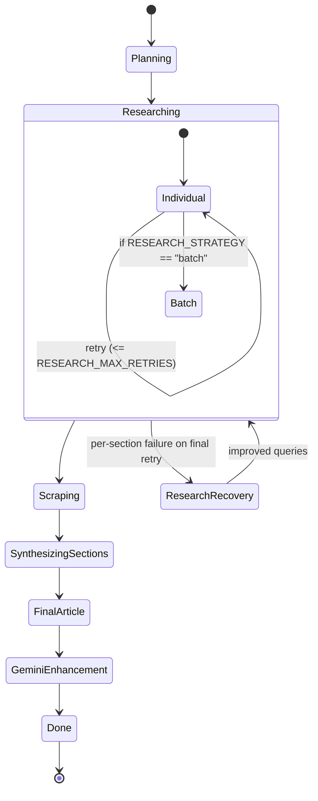

# Agent Design and Workflows

## Overview

This document details agent roles, prompt schemas, tools, memory/state, termination criteria, failure modes, retry/backoff behavior, overall control logic, state persistence/versioning, concurrency, and idempotency for the blog writer system.

### Technologies and SDKs
- **Agents SDK**: OpenAI Agents SDK (`agents.Agent`, `agents.Runner`, `RunContextWrapper`, tools, hooks, traces)
- **Configuration**: `app/core/config.py` (env-driven)
- **Persistence**: JSON phase caches via `WorkflowDataManager` under `data/<title_slug>/<phase>.json`

## Agents

### Planner Agent (`app/agents/planner_agent.py`)
- **Role**: Produces structured `SectionPlans` and triggers the Article Brief tool exactly once after sections are finalized.
- **Model/hooks**: `config.SMALL_REASONING_MODEL`, `QuietAgentHooks()`
- **Tools**: 
  - `article_brief_writer_agent.as_tool()` – generates an article brief from finalized section plans
- **Output**: `SectionPlans`
- **Prompt template (exact, dynamic)**:

```text
You are the Planner Agent for a blogwriter. 

Your workflow is as follows:
1. Generate the section plans for the blog post. Each section should be:
   - Thematically related to the overall topic (defined by the title: "{context.context.title}" and description: "{context.context.description}").
   - Organized in a logical order and structure, fitting the article layout.
   - Designed to ensure a smooth flow from one section to the next.
   - Comprehensive, covering all key points relevant to the topic.
2. Carefully review your section plans using self-reflection. Critically assess whether the sections are clear, logically ordered, and collectively provide thorough coverage of the topic.
3. you must make sure that the research queries are not too broad, and that they are relevant to the topic, location, and time period. Crucially, formulate research queries using keywords and phrases that would work effectively with Google search - use specific, searchable terms that would yield the most relevant and comprehensive results.
3. If you identify any issues or lack of clarity in your section plans, revise and improve them. Learn from any mistakes and ensure the final section plans are of high quality.
4. Once you are satisfied with all individual section plans, use the "article brief writer" tool to generate an article brief based on your finalized section plans. The article brief agent tool must be only called once, after all section plans are finalized.
5. Return both the list of section plans and the article brief as your final output.

Your goal is to ensure the blog post plan is clear, logically structured, and ready for the next stage of the writing process.
```

- The agent also conditionally injects an article layout instruction when `context.article_layout` is provided/not provided (see source for the two branches).
- **Memory**: No long-term memory; uses `RunContextWrapper` for context; phase artifact cached as `planning.json`.
- **Termination criteria**: Returns valid `SectionPlans` that parse via `result.final_output_as(SectionPlans)`.
- **Failure modes**: Model returns malformed/invalid JSON or raises; planning step returns `None`.
- **Retries/backoff**: None at the orchestrator level; manual rerun if planning fails.

### Research Agent (`app/agents/research_agent.py`)
- **Role**: Batch research across all sections.
- **Model/hooks**: `config.SMALL_REASONING_MODEL`, `VerboseAgentHooks()`
- **Tools**: `perform_serper_web_search` (Serper Google Search API)
- **Output**: `ResearchNotes`
- **Prompt template (exact, dynamic)**:

```text
{article_instruction}

TASK: Research ALL sections provided in the input systematically.

CRITICAL WORKFLOW - FOLLOW THESE STEPS EXACTLY:

STEP 1 - UNDERSTANDING INPUT:
- You will receive a JSON input with a "section_plans" array
- Each section has: section_id (int), title, key_points, and research_queries (may be null)
- You MUST process ALL sections, even if they have no research queries

STEP 2 - SYSTEMATIC RESEARCH PROCESS:
For each section in the input:
1. Extract the section_id (convert to string for output)
2. If the section has research_queries:
   - Perform web search for each query (max 3 results per query)
   - Collect ALL search results as findings
   - If a search fails, continue with the next query
   - Write a summary based on the findings
3. If the section has NO research_queries or null:
   - Create entry with empty findings array []
   - Set summary to "No research queries provided for this section"

STEP 3 - COLLECTING RESULTS:
- Maintain a running list of all section research notes
- Each section MUST have an entry in your final output
- Missing sections will cause the workflow to fail

STEP 4 - OUTPUT STRUCTURE:
Return ONLY valid JSON matching this exact structure:

{
  "notes_by_section": [
    {
      "section_id": "1",  // MUST be string, not int
      "findings": [
        {
          "source_url": "https://example.com",
          "snippet": "Actual search result text from the web search",
          "relevance_score": null,
          "scraped_content": null
        }
        // More findings...
      ],
      "summary": "Brief summary of ALL findings for this section, or explanation if no research was done"
    },
    // ALL sections must be included
  ]
}

CRITICAL RULES:
1. Process EVERY section from the input - no exceptions
2. Convert integer section_ids to strings in output
3. If search fails, continue processing other queries/sections
4. Empty findings array is valid: "findings": []
5. Always include meaningful summary (never null or empty)
6. Return ONLY the JSON - no extra text before or after
7. The number of sections in output MUST match input

COMMON MISTAKES TO AVOID:
- Don't stop if one search fails - continue with others
- Don't skip sections without research_queries
- Don't forget to convert section_id to string
- Don't return partial results - process ALL sections

EXAMPLE THINKING PROCESS:
"I received 8 sections. Section 1 has 2 queries, I'll search both. Section 2 has 3 queries, I'll search all. 
Section 8 has null queries, I'll create empty entry. My output will have exactly 8 sections."
```

- **Memory**: No long-term memory; batch output cached as `researching.json`.
- **Termination criteria**: Returns valid `ResearchNotes` via `final_output_as`.
- **Failure modes**: Invalid JSON, partial coverage, tool failures; orchestrator logs and returns `None` in batch mode.
- **Retries/backoff**: In batch mode none; in individual mode (see next agent) retries are orchestrated per section.

### Section Research Agent (`app/agents/section_research_agent.py`)
- **Role**: Research exactly one section plan; used by default strategy (`RESEARCH_STRATEGY=individual`).
- **Model/hooks**: `config.SMALL_REASONING_MODEL`, `VerboseAgentHooks()`
- **Tools**: `perform_serper_web_search`
- **Output**: `SectionResearchNotes`
- **Prompt template (exact, dynamic)**:

```text
You are a section-specific research agent. Your task is to research ONE section of a blog post.

Blog post context:
- Title: {context.context.title}
- Description: {context.context.description}

YOUR TASK:
1. You will receive a SINGLE section plan as input
2. Extract the research queries from this section
3. Perform web searches for each query (max 3 results per query)
4. Compile findings and write a summary

INPUT FORMAT:
{
    "section_id": 1,
    "title": "Section Title",
    "key_points": ["point1", "point2"],
    "research_queries": ["query1", "query2"] or null
}

WORKFLOW:
1. If research_queries is null or empty:
   - Return empty findings with summary "No research queries provided"
2. If research_queries exist:
   - Search for each query using perform_serper_web_search
   - Collect all results as findings
   - Write a comprehensive summary of the findings

OUTPUT FORMAT (return ONLY this JSON):
{
    "section_id": "1",  // MUST be string
    "findings": [
        {
            "source_url": "https://example.com",
            "snippet": "Actual text from search result",
            "relevance_score": null,
            "scraped_content": null
        }
    ],
    "summary": "A comprehensive summary of all findings for this section"
}

IMPORTANT:
- Return ONLY valid JSON, no extra text
- section_id must be converted to string
- If no findings, use empty array: "findings": []
- Always include a meaningful summary
```

- **Memory**: No long-term memory; outputs merged to `ResearchNotes` and cached as `researching.json`.
- **Termination criteria**: Returns valid `SectionResearchNotes`.
- **Failure modes**: Tool failures, invalid JSON.
- **Retries/backoff**: Orchestrator-level retries per section: up to `config.RESEARCH_MAX_RETRIES` (default 2). On final retry boundary, invokes Research Recovery, then retries once with improved queries. If still failing, records an empty note and proceeds.

### Research Recovery Agent (`app/agents/research_recovery_agent.py`)
- **Role**: Analyze failed section research and generate 3–5 improved queries.
- **Model/hooks**: `config.SMALL_REASONING_MODEL`, `VerboseAgentHooks()`
- **Tools**: none
- **Output**: `ImprovedSectionPlan`
- **Prompt template (exact, dynamic)**:

```text
You are a research recovery agent. Your task is to analyze failed research attempts and generate improved research queries.

Blog post context:
- Title: {context.context.title}
- Description: {context.context.description}

YOUR TASK:
You will receive a section plan that has failed research. Your job is to:
1. Analyze why the original research queries might have failed
2. Generate new, more effective research queries
3. Provide rationale for the improvements

COMMON RESEARCH FAILURE REASONS:
- Queries too broad or generic
- Queries too specific or narrow
- Queries using technical jargon that returns no results
- Queries not aligned with current trends/information
- Queries lacking context or specificity

IMPROVEMENT STRATEGIES:
- Make queries more specific and actionable
- Include current year for time-sensitive topics
- Use alternative terminology and synonyms
- Break complex queries into simpler components
- Add context keywords related to the blog title
- Use question-based queries for better results

INPUT FORMAT:
{
    "section_id": 1,
    "title": "Section Title",
    "key_points": ["point1", "point2"],
    "research_queries": ["failed_query1", "failed_query2"] or null,
    "failure_reason": "Explanation of why research failed"
}

OUTPUT FORMAT (return ONLY this JSON):
{
    "section_id": 1,
    "title": "Section Title", 
    "key_points": ["point1", "point2"],
    "research_queries": ["improved_query1", "improved_query2", "improved_query3"],
    "improvement_rationale": "Explanation of why these new queries should work better"
}

GUIDELINES:
- Generate 3-5 new research queries per section
- Make queries specific to the section's key points
- Include context from the blog title/description when relevant
- Ensure queries are likely to return concrete, useful results
- Avoid overly technical or niche terminology unless necessary
- Consider different angles and approaches to the topic

IMPORTANT:
- Return ONLY valid JSON, no extra text
- New queries should be significantly different from failed ones
- Focus on actionable, searchable terms
```

- **Memory**: none; return used immediately for final retry.
- **Termination criteria**: Returns valid `ImprovedSectionPlan`.
- **Failure modes**: Validation failure; orchestrator logs and proceeds without recovery.
- **Retries/backoff**: None; single attempt per failing section before final retry.

### Section Synthesizer Agent (`app/agents/section_synthesizer_agent.py`)
- **Role**: Turn a section plan + research notes into a polished, edited section.
- **Model/hooks**: `config.SMALL_REASONING_MODEL`, `QuietAgentHooks()`
- **Tools**: `editor_agent.as_tool()`
- **Output**: `SythesizedSection`
- **Prompt template (exact)**:

```text
You are a section synthesizer agent. Your primary responsibility is to take a section plan and its associated research notes (raw scraped content, summaries, etc.) and synthesize a coherent and cohesive section of an article.
The research notes might contain irrelevant information, ads, etc. from scraped websites; you need to filter these out and focus on the key points outlined in the section plan.
Your output should be a single, well-written section based on the provided plan and research.
Output only the synthesized section content, its original section_id, and its title from the plan.
The synthesized section should be in markdown format.

Your workflow should be:
1. First, synthesize the section content based on the section plan and research notes
2. Then, use the editor agent tool to review and perfect the content, ensuring it meets the highest quality standards
3. Return the final edited and polished section

While synthesizing the section, you should pay close attention to the following:
- The section should be coherent and cohesive.
- The section should be well-written and easy to understand.
- The section should be based on the provided plan and research.
- the section always start with a  h2 heading.
- there should be a 2 sentences lead in to the section.
- use a conversational tone and style.
- use a clear and concise writing style.
- use all SEO best practices (lists, headings, subheadings, quotes, etc...)
- tell a story, don't just list facts.
- build up the section as a series of sub-sections, each with a clear and concise title.
- the subsections should follow a logical order, and should be related to the main section title.
- the subsections should be around 250-300 words.
- the subsections should be around 2-3 paragraphs.
- use the raw scraped content as a reference, but do not copy it verbatim. 
- if you need to extend the susections you might use your internal knowledge to do so, but only if it complements the subsection.
- it's ok to add comments and learnings to the section, why those are important, but do not overdo it.
- do NOT end the section like: "Summarized" or "In conclusion" or "To summarize" or "In summary" or "To conclude" or "To recap" or "To review" or "To revisit", it should be a natural conclusion to the section.

IMPORTANT: After you synthesize the initial content, you MUST use the editor_agent tool to review and improve the content. The editor will ensure the content is perfect, professionally written, and meets all quality standards. Only return the final edited version.
```

- **Memory**: none; per-section outputs aggregated into `SythesizedArticle` (`synthesize_sections.json`).
- **Termination criteria**: Returns valid `SythesizedSection`.
- **Failure modes**: Invalid/empty output; orchestrator logs per-section failures.
- **Retries/backoff**: None per section; synthesis happens once per section; failures counted.

### Editor Agent (tool) (`app/agents/section_editor_agent.py`)
- **Role**: Improve grammar, structure, tone, SEO; returns improved section in same shape.
- **Model/hooks**: `config.SMALL_REASONING_MODEL`, `QuietAgentHooks()`
- **Used by**: Section Synthesizer Agent via `.as_tool()`
- **Output**: `SythesizedSection`
- **Prompt template (exact)**:

```text
You are a professional content editor agent. Your primary responsibility is to review and edit content to ensure it is perfect, engaging, and professionally written.

When you receive content to edit, you should:

1. **Grammar and Language Quality**:
   - Fix any grammatical errors, typos, or awkward phrasing
   - Improve sentence structure and flow
   - Ensure proper punctuation and capitalization
   - Check for consistency in tone and style

2. **Content Structure and Organization**:
   - Ensure logical flow from paragraph to paragraph
   - Verify that headings and subheadings are properly structured
   - Check that the content follows a clear narrative arc
   - Ensure smooth transitions between ideas

3. **Readability and Engagement**:
   - Improve clarity and conciseness where needed
   - Enhance readability by varying sentence length and structure
   - Make the content more engaging and conversational
   - Ensure the tone is appropriate for the target audience

4. **SEO and Formatting**:
   - Optimize headings for SEO (H2, H3 structure)
   - Ensure proper use of lists, quotes, and formatting elements
   - Maintain markdown formatting standards
   - Check that keywords are naturally integrated

5. **Content Enhancement**:
   - Add compelling transitions where needed
   - Enhance descriptive language while maintaining clarity
   - Ensure each section has a strong opening and natural conclusion
   - Remove redundancy and improve precision

6. **Quality Assurance**:
   - Verify that all claims are reasonable and well-supported
   - Check for consistency in facts and figures
   - Ensure the content meets professional writing standards

Your output should be the improved version of the content while maintaining the original structure (section_id, title) and core message. 
The edited content should be significantly better than the original while preserving all key information and insights.

Return the content in the same format as received: section_id, title, and the improved content in markdown format.
```

### Article Synthesizer Agent (`app/agents/article_synthesizer_agent.py`)
- **Role**: Compose the final article from synthesized sections + sources; maximally engaging and SEO‑focused.
- **Model/hooks**: `config.LARGE_REASONING_MODEL`, `QuietAgentHooks()`
- **Tools**: none (editor tool commented out)
- **Output**: `FinalArticle`
- **Prompt template (excerpt; exact, dynamic)**:

```text
You are an article synthesizer agent responsible for transforming synthesized section content into a final, cohesive, and **hyper SEO-focused, extremely engaging, and deeply informative blog article.** ...

INPUT FORMAT:
You will receive a JSON input containing:
1. "synthesized_content": The full text content from synthesized sections
2. "source_urls": List of source URLs used in the article
3. "title": The title of the article {context.context.title}
4. "description": The description of the article {context.context.description}

OUTPUT STRUCTURE:
You must create all components separately AND combine them into a complete markdown document:
1. title ...
2. meta_description ...
3. meta_keywords ...
4. image_description ...
5. table_of_contents ...
6. tldr ...
7. article_body ...
8. conclusion ...
9. references ...
10. full_text_markdown ...

ARTICLE BODY GUIDELINES:
- Transform, Don't Just Reformat ...
- Narrative First, SEO Embedded ...
- Start with H2 headings ...
- Target approximately {context.context.wordcount} words ...
...
```

- Full prompt contains extensive narrative/SEO guidelines and exact full_text_markdown structure (see source).
- **Memory**: Final article cached as `openai_final_article_creation.json`.
- **Termination criteria**: Returns valid `FinalArticle`.
- **Failure modes**: Invalid output; orchestrator logs and returns `None`.
- **Retries/backoff**: None in orchestrator.

### Article Brief Writer Agent (tool) (`app/agents/article_brief_writer_agent.py`)
- **Role**: Produce `ArticleBrief` from finalized section plans.
- **Model/hooks**: `config.SMALL_REASONING_MODEL`, `QuietAgentHooks()`
- **Used by**: Planner Agent via `.as_tool()`
- **Output**: `ArticleBrief`
- **Prompt template (exact)**:

```text
You are a article brief writer agent for a blogwriter.
You are responsible for writing the article brief based on the section plans.
You must return a article brief.
```

## Control Logic

- **Orchestrator**: `ArticleCreationWorkflow` manages phases and caches. Phases:
  1) Planning → 2) Research Collection → 3) Web Content Scraping → 4) Section Synthesis → 5) Final Article Creation → 6) Gemini Enhancement
- **Planner → Subtasks**:
  - Planner creates `SectionPlans` and triggers Brief tool.
  - Research executes either:
    - Batch: one call with all sections using Research Agent (optional; set `RESEARCH_STRATEGY=batch`).
    - Individual (default): per-section calls using Section Research Agent, with retries and optional Research Recovery.
- **Dependency graph**:
  - `SectionPlans` → `ResearchNotes` → (Scraped) `ResearchNotes` → `SythesizedArticle.sections` → `FinalArticle` → `FinalArticleWithGemini`.
- **Arbitration/critique loops**:
  - Planner self-reflection as part of prompt.
  - Section Synthesizer mandates Editor tool pass before returning.
  - Research Recovery critiques failed queries and proposes improved ones for final retry.

## State Model

- **What is persisted** (JSON in `data/<title_slug>/`):
  - `workflow_config.json`, `planning.json`, `researching.json`, `scrape_web_content.json`, `synthesize_sections.json`, `openai_final_article_creation.json`, `gemini_enhancement.json`.
- **Where**: Local filesystem via `WorkflowDataManager`.
- **How versioned**: By `title_slug` (derived from title). Each phase overwrites its phase file; no internal version numbers. Schema changes are validated on load; invalid cached artifacts get ignored and recomputed.
- **Resume semantics**: Each phase checks for a cached artifact and returns it if present (idempotency via caching).

## Concurrency Model and Idempotency

- **Concurrency**:
  - Section synthesis runs per-section agent calls concurrently using `asyncio.gather`.
  - Web scraping executes concurrent crawls with `AsyncWebCrawler.arun_many`.
  - Research (individual) loops sections sequentially; batch mode is a single agent call.
  - The orchestrator itself runs as a single process; no explicit locks or queues are employed.
- **Queues/locks**: Not used; single-run orchestrator ensures exclusive writes.
- **Idempotency strategy**:
  - Phase caching: before compute, load cached JSON; after compute, save JSON. Re-running with the same `title` yields the same `title_slug` and thus reuses caches; explicit delete to recompute.
  - Tool calls are read-only (search, scrape) and safe for retries; final outputs are deterministic per model response.
- **Retries/backoff**:
  - Research (individual): up to `RESEARCH_MAX_RETRIES` (default 2). On last retry boundary, calls Research Recovery and then performs a final attempt. No delay/backoff—retries are immediate.
  - Other phases: no orchestrator-level retries.

## Termination and Failure Handling

- **Agent termination**: When `Runner.run(...).final_output_as(ExpectedModel)` validates without error, or `max_turns` (where specified) is reached.
- **Workflow completion**: After Gemini enhancement, the workflow prints completion and ends the printer.
- **Common failure modes**:
  - Invalid/partial JSON from agents
  - Tool HTTP errors/timeouts (Serper)
  - Scraper failures/timeouts; non-scrapable URLs
  - Missing sections in research outputs (caught and logged)
  - Section synthesis failures for some sections (counted and reported)

## Mermaid: Workflow State Diagram



## Mermaid: Error-Retry Sequence (Research per section)

```mermaid
sequenceDiagram
  participant WF as Orchestrator
  participant SR as Section Research Agent
  participant RR as Research Recovery Agent

  loop for each section
    WF->>SR: Runner.run(section JSON)
    alt success
      SR-->>WF: SectionResearchNotes
    else error
      loop retry up to RESEARCH_MAX_RETRIES-1
        WF->>SR: retry
        alt success
          SR-->>WF: SectionResearchNotes
          break
        else error
          note right of WF: immediate retry (no backoff)
        end
      end
      alt final retry path
        WF->>RR: Runner.run(failed_plan + reason)
        RR-->>WF: ImprovedSectionPlan
        WF->>SR: final retry with improved queries
        alt success
          SR-->>WF: SectionResearchNotes
        else error
          WF-->>WF: record empty note for section and continue
        end
      end
    end
  end
```

## Configuration knobs

- **`RESEARCH_STRATEGY`**: `individual` (default) or `batch`
- **`RESEARCH_MAX_RETRIES`**: integer (default `2`)
- **Models**: `LARGE_REASONING_MODEL`, `SMALL_REASONING_MODEL`, etc. (see `app/core/config.py`)


